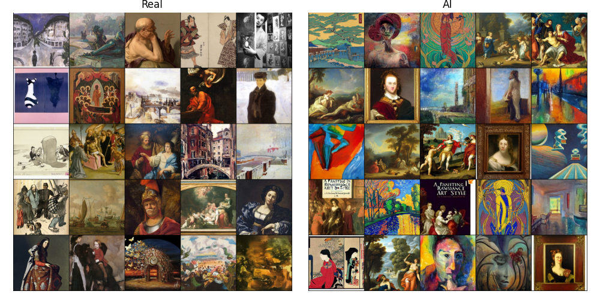
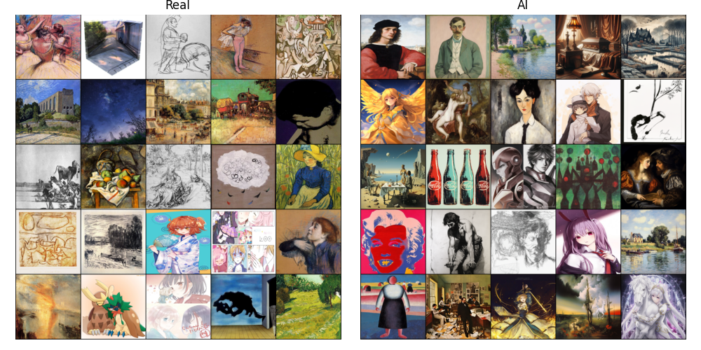

# MSAI-Capstone
A comparative analysis of State-of-the-Art AI image detection methods applied to artwork-only datasets. This project investigates a research gap in universal AI image detection and examines trends in physical or digital human-created artwork data.

<ins>[Andrew Murphy](mailto:acm7552@rit.edu)</ins>

<div align="left">

<p><i>Figure: Samples from the ArtBench dataset.</i></p>
</div>
<div align="right">

<p><i>Figure: Samples of 'artwork' and 'pixiv' images from the ARIA dataset.</i></p>
</div>
  
## 📋 Table of Contents
- [MSAI-Capstone](#msai-capstone)
  - [📋 Table of Contents](#-table-of-contents)
  - [Installation](#installation)
    - [Clone the repository](#clone-the-repository)
    - [Create and activate conda environment](#create-and-activate-conda-environment)
    - [Install additional dependencies if any](#install-additional-dependencies-if-any)
    - [Install comparison models](#install-comparison-models)
      - [AEROBLADE](#aeroblade)
      - [RIGID](#rigid)
      - [SPAI](#spai)
      - [LOTA](#lota)
  - [Project Structure](#project-structure)
  - [Usage](#usage)
    - [Datasets - ARIA and AI-ArtBench](#datasets---aria-and-ai-artbench)
    - [SavedModels](#savedmodels)
      - [Resnet50 backbone and Zero-shot CLIP](#resnet50-backbone-and-zero-shot-clip)
      - [Usage examples](#usage-examples)
      - [Other Models](#other-models)
      - [Training and Evaluation](#training-and-evaluation)
  - [Results \& Visualization](#results--visualization)
  - [Acknowledgements](#acknowledgements)
  - [Citation](#citation)
  - [License](#license)

## Installation
### Clone the repository
```bash
git clone https://github.com/github_repo.git
cd msai_capstone
```
### Create and activate conda environment
```bash
conda env create -f environment.yml
conda activate msai_capstone
```
### Install additional dependencies if any
```bash
pip install -e .
```

### Install comparison models

Clone the following repositories and follow their respective installation guides. Place projects in the `scripts/` directory. Certain files have been configured to accept the AI-ArtBench and ARIA datasets instead of the datasets used in their original experimentation, and should be overwritten with the versions contained in this repository. Those files can be found in the appropriate project files in the `scripts/` directory. The models for this study can be found here:

#### AEROBLADE: Training-Free Detection of Latent Diffusion Images Using Autoencoder Reconstruction Error: https://github.com/jonasricker/aeroblade

#### RIGID: A Training-free and Model-Agnostic Framework for Robust AI-Generated Image Detection: https://github.com/IBM/RIGID/

#### SPAI: Spectral AI-Generated Image Detector: https://github.com/mever-team/spai

#### LOTA: LOTA: Bit-Planes Guided AI-Generated Image Detection: https://github.com/hongsong-wang/LOTA

#### DIRE for Diffusion-Generated Image Detection: https://github.com/zhendongwang6/dire

#### SSP-AI-Generated-Image-Detection: https://github.com/bcmi/SSP-AI-Generated-Image-Detection/tree/main

## Project Structure

```
msai_capstone/
    ├── data/          # Dataset storage and data files
        ├── ARIA_dataset/
        ├── Real_AI_SD_LD_Dataset/
    ├── scripts/       # Standalone scripts and utilities
        ├── AEROBLADE/
        ├── SPAI/
        ├── LOTA/
        ├── RIGID/
        ├── DIRE/
        ├── SSP/
    ├── models/        # Trained model checkpoints
    ├── notebooks/     # Jupyter notebooks for analysis
    ├── results/       # Experimental results and metrics
        ├── AEROBLADE_outputs/
        ├── RIGID_outputs/
        ├── SPAI_outputs/
        ├── LOTA_outputs/
        ├── DIRE_outputs/
        ├── SSP_outputs/
        ├── RESNET50_outputs/
        ├── VLM_outputs/
    ├── figures/       # Project figures and visualizations
    └── README.md      # Project documentation
```


## Usage

### Datasets - ARIA and AI-ArtBench

AiArtBench.py and ARIAdataset.py contain functions to load the datasets to be used for the comparative analysis. They are imported into the testing and evaluation files. download_AI_ArtBench.py was used to download AI-ArtBench images to Narnia, while zip files for ARIA were manually uploaded and placed in the datasets folder. The AI-ArtBench dataset can be downloaded [here](https://www.kaggle.com/datasets/ravidussilva/real-ai-art/data), or via the API script at `download_AI_ArtBench.py`. The ARIA dataset can be downloaded [here](https://github.com/AdvAIArtProject/AdvAIArt?tab=readme-ov-file).


## SavedModels
This folder is where model checkpoints are saved if --save is set to True.

### Resnet50 backbone and Zero-shot CLIP

resnet50baseline.py and inference_resnet50baseline.py are for initializing, loading, training and testing that baseline. By default, resnet50baseline.py uses 10 epochs, a batch size of 64, a randeom seed of 42, automatically performs inference, and automatically generates visualization results. The option to save the best model for inference_resnet50baseline.py can be enabled by setting --save to True.

Because zero-shot VLM prompting requires no training, there is only the inference function in zeroshotVLM.py. 


### Usage examples:

```
python resnet50baseline.py --epochs 10 --dataset aria --eval True --save False
```

```
python inference_resnet50baseline.py root/path/toModelHere
```

```
python zeroshotVLM.py --dataset artbench
```

### Other Models

See respective repository READMEs for setting up the proper Python environment, data setup, training (if desired), evaluation. For this study, the only datasets required and used are AI-ArtBench and ARIA. Adjust config files as necessary for performing inference on the desired data.

### Training and Evaluation


## Results & Visualization

### AI_ArtBench Results

| Model              | Acc | AP   | AUC  |
|-------------------|----------|------|------|
| ResNet50         | .985       | .986  | .998   |
| CLIP             | .642       | .674   | .770   |
| AEROBLADE        | .481      |  .406  | .310   |
| RIGID            | .530       | .525   | .512   |
| LOTA             | .453       | .680   | .513   |
| SPAI             | .821       | .907  | .873   |
| DIRE             |  .330       | .664    | .484    |
| SSP              |  .666      |  .689   | .537    |


### ARIA Results

| Model              | Acc | AP   | AUC  |
|-------------------|----------|------|------|
| ResNet50         | .899      | .908   | .890  |
| CLIP             | .875      | .876   | .933   |
| AEROBLADE        | .486     | .403   | .311   |
| RIGID            | .946     | .989  | .988   |
| LOTA             | .260     | .840   | .411  |
| SPAI             | .741      | .969   | .823   |
| DIRE             |  .137       | .880    | .507    |
| SSP              | .851        |  .847   | .425    |


## Acknowledgements


The following works were selected for for this study. We thank their authors for their contribution.

```bibtex
@misc{ricker2024aerobladetrainingfreedetectionlatent,
      title={AEROBLADE: Training-Free Detection of Latent Diffusion Images Using Autoencoder Reconstruction Error}, 
      author={Jonas Ricker and Denis Lukovnikov and Asja Fischer},
      year={2024},
      eprint={2401.17879},
      archivePrefix={arXiv},
      primaryClass={cs.CV},
      url={https://arxiv.org/abs/2401.17879}, 
}
```

```bibtex
@misc{he2024rigidtrainingfreemodelagnosticframework,
      title={RIGID: A Training-free and Model-Agnostic Framework for Robust AI-Generated Image Detection}, 
      author={Zhiyuan He and Pin-Yu Chen and Tsung-Yi Ho},
      year={2024},
      eprint={2405.20112},
      archivePrefix={arXiv},
      primaryClass={cs.CV},
      url={https://arxiv.org/abs/2405.20112}, 
}
```

```bibtex
@inproceedings{karageorgiou2025any,
  title={Any-resolution ai-generated image detection by spectral learning},
  author={Karageorgiou, Dimitrios and Papadopoulos, Symeon and Kompatsiaris, Ioannis and Gavves, Efstratios},
  booktitle={Proceedings of the Computer Vision and Pattern Recognition Conference},
  pages={18706--18717},
  year={2025}
}
```


```bibtex
@misc{wang2025lotabitplanesguidedaigenerated,
      title={LOTA: Bit-Planes Guided AI-Generated Image Detection}, 
      author={Hongsong Wang and Renxi Cheng and Yang Zhang and Chaolei Han and Jie Gui},
      year={2025},
      eprint={2510.14230},
      archivePrefix={arXiv},
      primaryClass={cs.CV},
      url={https://arxiv.org/abs/2510.14230}, 
}
```

```bibtex
@article{wang2023dire,
  title={DIRE for Diffusion-Generated Image Detection},
  author={Wang, Zhendong and Bao, Jianmin and Zhou, Wengang and Wang, Weilun and Hu, Hezhen and Chen, Hong and Li, Houqiang},
  journal={arXiv preprint arXiv:2303.09295},
  year={2023}
}
```

```bibtex
@misc{chen2024singlesimplepatchneed,
      title={A Single Simple Patch is All You Need for AI-generated Image Detection}, 
      author={Jiaxuan Chen and Jieteng Yao and Li Niu},
      year={2024},
      eprint={2402.01123},
      archivePrefix={arXiv},
      primaryClass={cs.CV},
      url={https://arxiv.org/abs/2402.01123}, 
}
```

## Citation

If you use this code in your research, please cite:

```bibtex
@article{
  andrewmurphymsaicapstone2026,
  title="MSAI-Capstone",
  author="Andrew Murphy",
  institution="RIT",
  year="2026"
}
```


## License

This project is licensed under the MIT License - see the [LICENSE](LICENSE) file for details. All projects used in this study retain their original license. Review their license terms before use.
